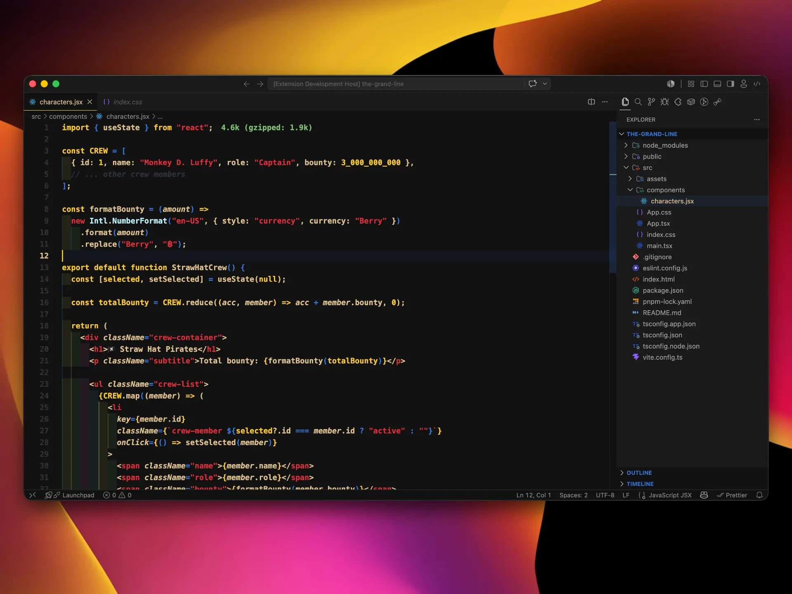
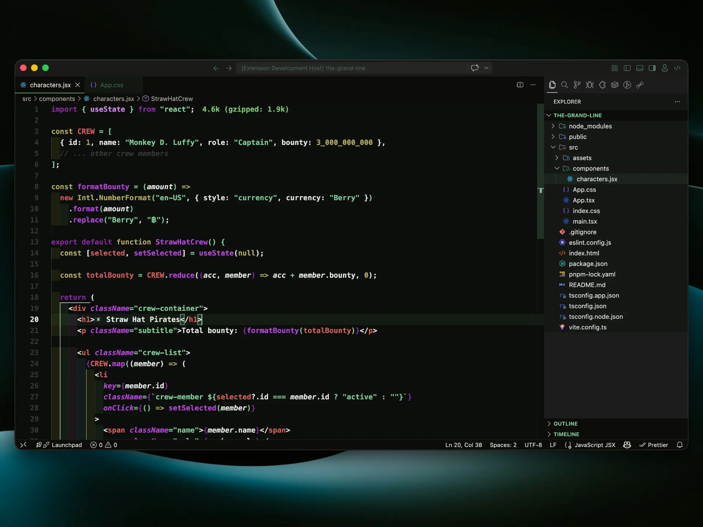

# The One Piece Theme 🏴‍☠️

*I'm going to be The King of the Pirates!*

Dark VS Code themes inspired by the world of One Piece. Built for long coding sessions on the Grand Line.

---

## Screenshots

*The One Piece Theme Dark*

*The One Piece Theme - Luffy*

*The One Piece Theme - Zoro*

---

## Color Palettes

### The One Piece Theme

| Role | Color | Meaning |
|---|---|---|
| Background | `#0d1b2a` | Deep ocean night |
| Sidebar / UI | `#0a1520` | The void of the Grand Line |
| Foreground | `#cadff3` | Ocean mist |
| Keywords / Operators | `#4a9eca` | Steel blue — The open sea |
| Classes / Types | `#8B6914` | Gold — One Piece treasure |
| Constants / Numbers | `#8B6914` | Gold — One Piece treasure |
| Strings | `#ffaa50` | Amber — The dawn of a new adventure |
| Errors | `#c0392b` | Crimson — The Pirate King's will |
| Functions | `#d1b31d` | Golden yellow — The Sunny's figurehead |
| Tags HTML | `#ff2323` | Vivid red — Jolly Roger |
| Comments | `#2a4a6a` | Dark navy — Secrets of the sea |

### The One Piece Theme - Luffy

| Role | Color | Meaning |
|---|---|---|
| Background | `#111111` | |
| Sidebar / UI | `#1a1a1a` | |
| Foreground | `#dfc18a` | Dusty Peach — Luffy's skin tone |
| Keywords / Operators | `#2f76dc` | Lagoon Blue — Luffy's shirt |
| Classes / Types | `#b9eff8` | Charlotte Blue — Sky and sea of the Grand Line |
| Constants / Numbers | `#fbc920` | Gold Rush — Luffy's straw hat |
| Strings | `#e62c39` | China Rose — Luffy's vest |
| Errors | `#e62c39` | China Rose — Luffy's vest |
| Functions | `#dfc18a` | Dusty Peach — Luffy's skin tone |
| Comments | `#2e333f` | Midnight — Shadows of the sea |

### The One Piece Theme - Zoro

| Role | Color | Meaning |
|---|---|---|
| Background | `#111111` | |
| Sidebar / UI | `#1a1a1a` | |
| Foreground | `#b8b6c3` | Shimmer Silver — Wado Ichimonji's blade |
| Keywords / Operators | `#aaeb83` | New Green — Zoro's haramaki and fighting spirit |
| Classes / Types | `#b8b6c3` | Shimmer Silver — Wado Ichimonji's blade |
| Constants / Numbers | `#808d71` | Battleship Gray — Shusui's steel |
| Strings | `#aaeb83` | New Green — Zoro's haramaki and fighting spirit |
| Errors | `#d55e5e` | Sandai Kitetsu — The cursed blade |
| Functions | `#808d71` | Battleship Gray — Shusui's steel |
| Tags HTML | `#8b25a6` | Enma — The blade that draws out one's power |
| Comments | `#375949` | Stromboli — The forest where Zoro trains |

---

## Installation

1. Open **Extensions** in VS Code (`Ctrl+Shift+X`)
2. Search for **The One Piece Theme**
3. Click **Install**
4. Open the Command Palette (`Ctrl+Shift+P`) → **Preferences: Color Theme** → select **The One Piece Theme Dark**

---

## Changelog

See [CHANGELOG.md](CHANGELOG.md) for the full list of changes.

---

## License

[MIT](LICENSE)