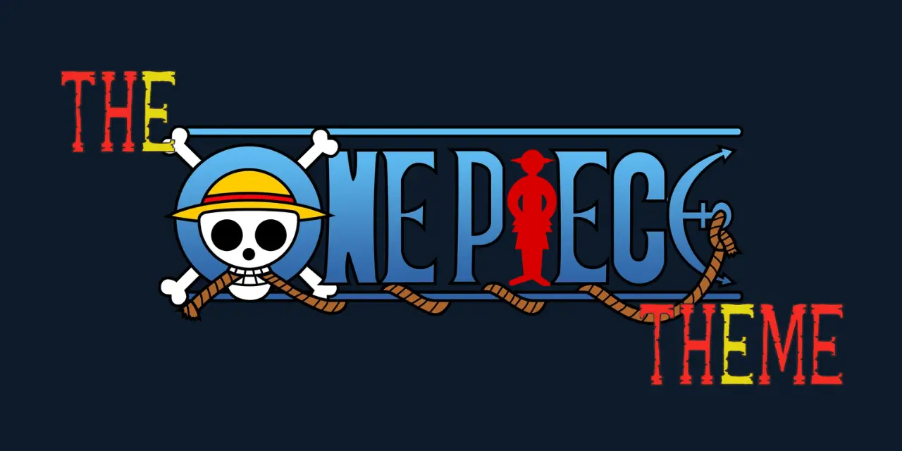
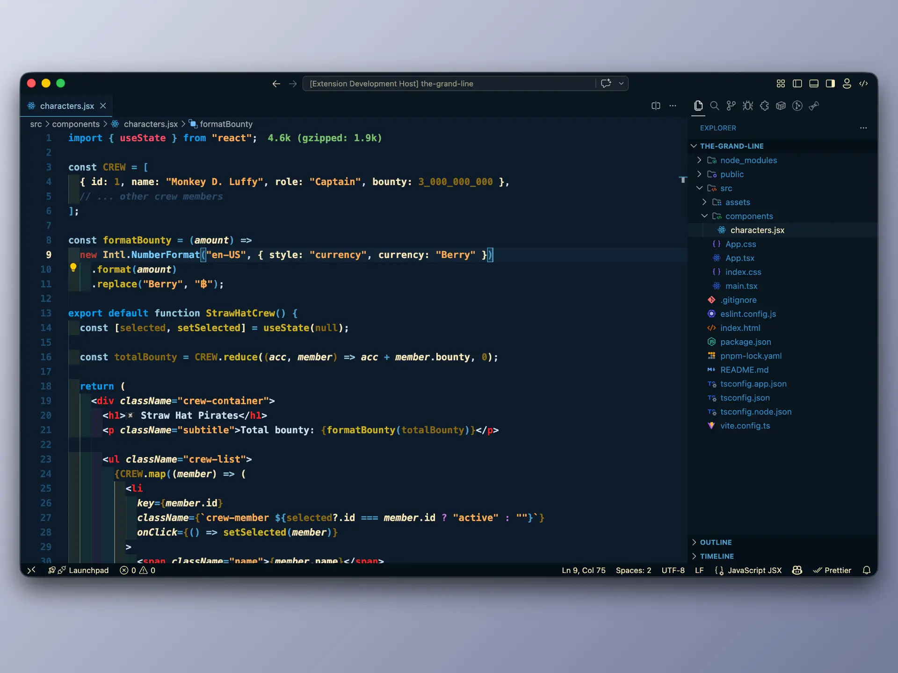

# The One Piece Theme 🏴‍☠️

I'm going to be King of the Pirates! Dark VS Code themes inspired by the world of One Piece. Built for long coding sessions on the Grand Line.

---

## Screenshots

---

## Color Palettes

### The One Piece Theme

| Role | Color |
|---|---|
| Background | `#0d1b2a` |
| Foreground | `#f9e7b8` |
| Accent (Blue) | `#4a9eca` |
| Accent (Red) | `#c0392b` |
| Gold | `#8b6914` |

---

## Installation

1. Open **Extensions** in VS Code (`Ctrl+Shift+X`)
2. Search for **The One Piece Theme**
3. Click **Install**
4. Open the Command Palette (`Ctrl+Shift+P`) → **Preferences: Color Theme** → select **The One Piece Theme Dark**

---

## License

[MIT](LICENSE)